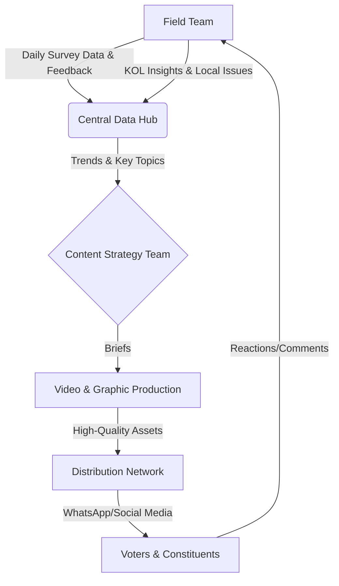

# Election Management Strategy: Assembly Constituency Deployment
**Prepared by:** Team BFox  
**Date:** November 30, 2025 (Strategy for 2026 Election)

---

## 1. Executive Summary

goAH Strategy Consultants LLP proposes a comprehensive, data-driven election management solution designed to capture the pulse of the constituency and translate it into actionable campaign momentum. Our approach combines **hyper-local human intelligence** with **high-impact digital storytelling**.

We will deploy a dedicated 25-member field team to conduct widespread surveys and engage with Key Opinion Leaders (KOLs). This real-time feedback loop will power our "Campaign Machine," ensuring that every piece of video and graphic content is relevant, resonant, and effectively distributed through a custom-built network.

---

## 2. Operational Strategy: The "Ears to the Ground" Approach

### 2.1 Field Deployment Structure
We will deploy a tiered workforce of **25 staff members** within the constituency for a duration of **90 Days (3 Months)** leading up to the election.

*   **1 Project Manager (PM):** Overall strategic lead, liaison with the candidate/party.
*   **4 Team Leaders (TLs):** Each managing a zone/sector of the constituency.
*   **20 Field Surveyors:** The foot soldiers conducting door-to-door and market-place interactions.

### 2.2 Core Activities
1.  **Widespread Surveys:**
    *   **Quantitative:** Standardized questionnaires to gauge vote share, issue alignment, and candidate favorability.
    *   **Qualitative:** "Mood of the Constituency" conversations to uncover hidden sentiments.
2.  **KOL Engagement:**
    *   Systematic mapping and regular dialogue with local influencers (Political workers, religious leaders, trade union heads, youth icons).
3.  **Political Intelligence:**
    *   Monitoring opposition activity and identifying swing booths.

---

## 3. The Campaign Machine: From Insight to Impact

Our proprietary workflow ensures that field data directly informs campaign narratives.

### 3.1 Content Creation (The Factory)
*   **Input:** Data reveals "Water Scarcity" is the top issue in Zone B.
*   **Output:** The Video/Graphic team immediately produces:
    *   A 30-sec reel of the candidate addressing water issues.
    *   Infographics comparing the candidate's track record vs. opposition.

### 3.2 Distribution Network (The Grid)
*   We will build a **Hyper-Local Distribution Network** (WhatsApp Groups, Broadcast Lists) segmented by booth and demographic.
*   Content is not just "posted" but "seeded" through our network of local volunteers and digital workers.

---

## 4. Financial Plan (Budget: ₹25,00,000)

This budget covers a **3-month intensive operational period**.

### 4.1 Human Capital (Field Operations)
| Role | Breakdown | Count | Monthly Cost | Total (3 Months) |
| :--- | :--- | :---: | :---: | :---: |
| **Field Surveyors** | Base: ₹15,000   Incentive: ₹3,000 | 20 | ₹18,000 | ₹10,80,000 |
| **Team Leaders** | Base: ₹25,000   Travel/Phone: ₹5,000 | 4 | ₹30,000 | ₹3,60,000 |
| **Project Manager** | Base: ₹45,000   Allowance: ₹5,000 | 1 | ₹50,000 | ₹1,50,000 |
| **Subtotal** | | | | **₹15,90,000** |

### 4.2 Campaign Machine (Content & Tech)
| Item | Breakdown | Total (3 Months) |
| :--- | :--- | :---: |
| **Video Editor** | 1 Dedicated Editor @ ₹40,000/mo | ₹1,20,000 |
| **Graphic Designer** | 1 Dedicated Designer @ ₹35,000/mo | ₹1,05,000 |
| **Content Strategist** | Part-time/Central Support @ ₹25,000/mo | ₹75,000 |
| **Tech Stack** | Survey App Licenses (₹50k)   Server/Data Dashboard (₹20k)   Social Media Tools (₹30k) | ₹1,00,000 |
| **Subtotal** | | **₹4,00,000** |

### 4.3 Logistics & Administration
| Item | Breakdown | Total (3 Months) |
| :--- | :--- | :---: |
| **Travel & Conveyance** | Fuel & Maintenance (~₹2,600/staff/mo) | ₹2,00,000 |
| **Food & Refreshments** | Daily Team Snacks & Water (~₹200/day/team) + Weekly Lunches | ₹1,50,000 |
| **Office Costs** | Rent (₹15,000/mo) | ₹45,000 |
| **Utilities** | Electricity & High-Speed Internet (₹5,000/mo) | ₹15,000 |
| **Subtotal** | | **₹4,10,000** |

### 4.4 Contingency
| Item | Description | Total (INR) |
| :--- | :--- | :---: |
| **Buffer Fund** | Unforeseen expenses, emergency printing, medical aid | ₹1,00,000 |
| **Subtotal** | | **₹1,00,000** |

### **Grand Total: ₹25,00,000 (Twenty-Five Lakhs INR)**

---

## 5. Conclusion
This deployment plan ensures **Team BFox** delivers not just data, but **dominance**. By integrating 25 boots-on-the-ground with a sophisticated content engine, we turn every voter interaction into a campaign asset.
